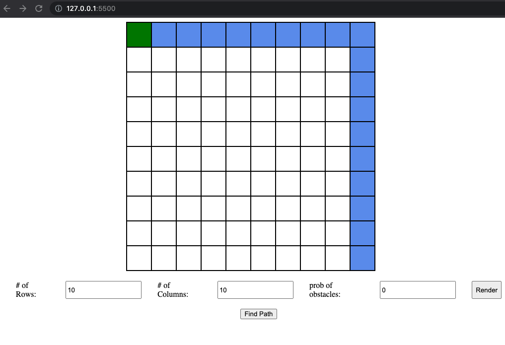

# Maze Finder with OpenAI GPT-3.5 Agent

This is a maze finder game with an AI agent powered by OpenAI's GPT-3.5 language model. The game is built using JavaScript for the front end and a Bottle-based Python API for communication with the AI agent.

Installation
To run the game, you will need to install the following software:

- Python 3
- Bottle (Python web framework)
- openai

Once you have installed Python 3, you can install Bottle and openai using pip:

```sh
pip install bottle
pip install openai
```

To use the OpenAI GPT-2.5 agent, you will need an OpenAI API key. You can sign up for an API key on the OpenAI website: https://beta.openai.com/signup/

Usage
To start the game, you will need to run the Python API server:

```sh
python ./server/server.py
```

This will start the Bottle-based API server on port 8080.

Next, open the index.html file in your web browser to start the maze finder game.

Generate a custom maze by providing a # of rows and # of cols. you can also include a probability for obstacles to appear (GPT3.5) doesn't do well once obstacles are in the way. but otherwise it seems to find the path even in grids up to 10x10.

click the render button to generate a new maze.

click the find path button and let gpt.3.5 do its thing.




## Cost of running

You can run the server with either `gpt-3.5-turbo` or `davinci-003`

- `gpt-3.5-turbo` cost ~$0.001/game
- `davinci-003` cost ~$0.01/game
